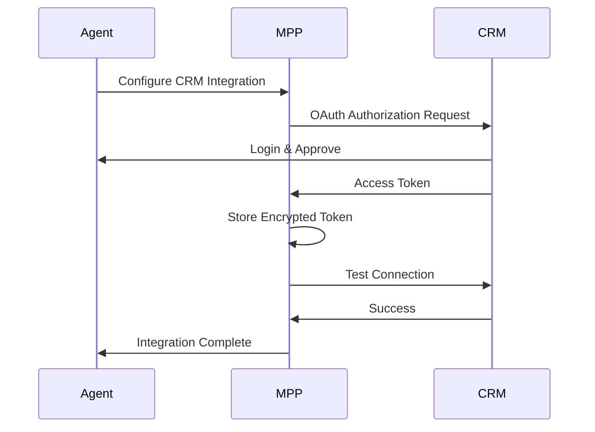
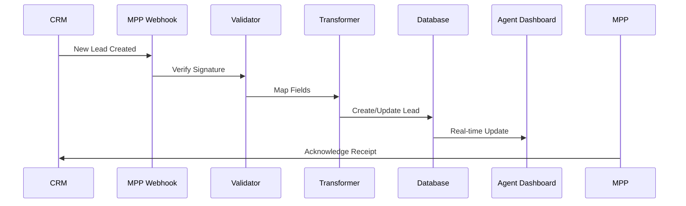
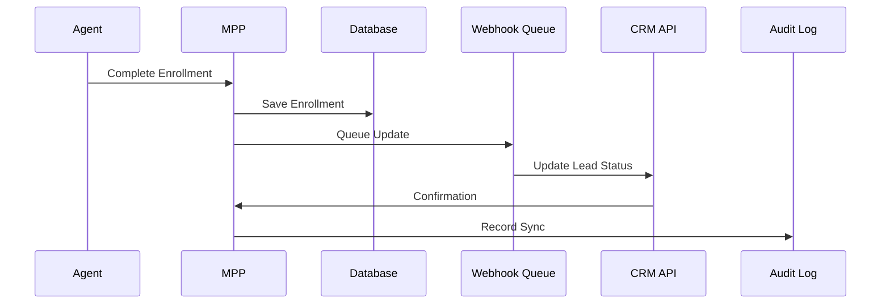

# CRM API Integration Design Document

## Overview

This document outlines the theoretical design for integrating MyPremierPlans with external CRM systems via API. The integration will support bidirectional data flow, allowing lead/client information to be imported from and exported to third-party CRM platforms.

## Integration Architecture

### 1. API Gateway Pattern

```
External CRMs <--> API Gateway <--> MyPremierPlans Core
                        |
                   Transformation
                      Layer
```

### 2. Supported Integration Types

#### A. Pull Integration (Import from CRM)
- Scheduled synchronization (hourly/daily)
- On-demand import via API endpoint
- Webhook-based real-time updates

#### B. Push Integration (Export to CRM)
- Real-time updates when leads are created/modified
- Batch export functionality
- Event-driven webhooks

#### C. Bidirectional Sync
- Conflict resolution strategies
- Last-write-wins or merge logic
- Audit trail for all changes

## API Design

### Authentication Methods

#### 1. API Key Authentication
```http
GET /api/v1/external/leads
Authorization: Bearer YOUR_API_KEY
```

#### 2. OAuth 2.0 Integration
```javascript
// OAuth flow for CRM connections
POST /api/v1/crm/oauth/authorize
{
  "crm_type": "salesforce",
  "redirect_uri": "https://mypremierplans.com/crm/callback"
}
```

#### 3. Webhook Security
- HMAC signature verification
- IP whitelisting
- Request timestamp validation

### Core API Endpoints

#### Lead Management APIs

##### Import Leads
```http
POST /api/v1/external/leads/import
Content-Type: application/json

{
  "source": "salesforce",
  "leads": [
    {
      "external_id": "SF-12345",
      "first_name": "John",
      "last_name": "Doe",
      "email": "john@example.com",
      "phone": "210-555-0123",
      "custom_fields": {
        "lead_source": "Website",
        "interest_level": "High"
      }
    }
  ]
}
```

##### Export Leads
```http
GET /api/v1/external/leads/export
?status=qualified
&date_from=2025-01-01
&format=json

Response:
{
  "leads": [
    {
      "id": 123,
      "external_id": "MPP-123",
      "first_name": "Jane",
      "last_name": "Smith",
      "status": "qualified",
      "agent_id": "agent123",
      "activities": [...]
    }
  ]
}
```

##### Sync Status
```http
GET /api/v1/external/sync/status
{
  "last_sync": "2025-01-10T10:30:00Z",
  "pending_updates": 5,
  "sync_errors": 0,
  "connected_crms": ["salesforce", "hubspot"]
}
```

### Webhook Endpoints

#### Incoming Webhooks (from external CRMs)
```http
POST /api/v1/webhooks/crm/{crm_type}
X-Webhook-Signature: sha256=...

{
  "event": "lead.created",
  "data": {
    "id": "EXT-789",
    "fields": {...}
  }
}
```

#### Outgoing Webhooks (to external CRMs)
```javascript
// Configuration
{
  "webhook_url": "https://crm.example.com/webhooks/mpp",
  "events": ["lead.created", "lead.updated", "enrollment.completed"],
  "secret": "webhook_secret_key"
}
```

## Data Mapping

### Standard Field Mappings

| MyPremierPlans Field | Salesforce | HubSpot | Pipedrive | Custom CRM |
|---------------------|------------|---------|-----------|------------|
| firstName | FirstName | firstname | first_name | configurable |
| lastName | LastName | lastname | last_name | configurable |
| email | Email | email | email | configurable |
| phone | Phone | phone | phone | configurable |
| status | Status | lifecyclestage | status | configurable |
| assignedAgentId | OwnerId | hubspot_owner_id | user_id | configurable |
| source | LeadSource | hs_lead_status | source | configurable |

### Custom Field Handling
```javascript
// Field mapping configuration
{
  "crm_type": "salesforce",
  "field_mappings": {
    "mpp_fields": {
      "memberType": "Member_Type__c",
      "planInterest": "Healthcare_Plan__c",
      "employerName": "Company"
    },
    "custom_transformations": {
      "status": {
        "new": "Open",
        "contacted": "Working",
        "qualified": "Qualified",
        "enrolled": "Closed Won"
      }
    }
  }
}
```

## Integration Flows

### 1. Initial CRM Connection Flow



### 2. Lead Import Flow



### 3. Enrollment Sync Flow



## Common CRM Integrations

### 1. Salesforce Integration
```javascript
// Configuration example
{
  "crm_type": "salesforce",
  "auth_type": "oauth2",
  "instance_url": "https://mycompany.salesforce.com",
  "api_version": "v57.0",
  "objects": {
    "lead": "Lead",
    "contact": "Contact",
    "opportunity": "Opportunity"
  }
}
```

### 2. HubSpot Integration
```javascript
{
  "crm_type": "hubspot",
  "auth_type": "oauth2",
  "portal_id": "12345678",
  "scopes": ["crm.objects.contacts.read", "crm.objects.contacts.write"]
}
```

### 3. Custom CRM Integration
```javascript
{
  "crm_type": "custom",
  "auth_type": "api_key",
  "base_url": "https://api.customcrm.com/v2",
  "endpoints": {
    "get_leads": "/leads",
    "create_lead": "/leads",
    "update_lead": "/leads/{id}"
  }
}
```

## Error Handling & Retry Logic

### Retry Strategy
```javascript
{
  "retry_config": {
    "max_attempts": 3,
    "initial_delay": 1000, // ms
    "max_delay": 30000,
    "backoff_multiplier": 2
  },
  "error_handling": {
    "rate_limit": "exponential_backoff",
    "network_error": "retry_with_backoff",
    "auth_error": "refresh_token",
    "validation_error": "log_and_skip"
  }
}
```

### Error Response Format
```json
{
  "error": {
    "code": "CRM_SYNC_FAILED",
    "message": "Failed to sync lead to Salesforce",
    "details": {
      "crm_error": "DUPLICATE_VALUE",
      "field": "Email",
      "attempted_value": "john@example.com"
    },
    "retry_after": "2025-01-10T11:00:00Z"
  }
}
```

## Security Considerations

### 1. Data Encryption
- All API keys and tokens encrypted at rest
- TLS 1.3 for all API communications
- Field-level encryption for sensitive data (SSN, etc.)

### 2. Access Control
- Role-based permissions for API access
- Separate API keys per integration
- Rate limiting per API key

### 3. Audit Trail
```javascript
{
  "event": "lead.synced",
  "timestamp": "2025-01-10T10:30:00Z",
  "user": "agent123",
  "crm": "salesforce",
  "action": "update",
  "fields_changed": ["status", "last_contact_date"],
  "ip_address": "192.168.1.1"
}
```

## Implementation Phases

### Phase 1: Read-Only Integration (Month 1)
- Import leads from external CRMs
- View sync status
- Manual trigger for imports

### Phase 2: Bidirectional Sync (Month 2)
- Export leads to CRMs
- Update lead status in both systems
- Basic conflict resolution

### Phase 3: Advanced Features (Month 3)
- Real-time webhooks
- Custom field mappings
- Multiple CRM support
- Automated enrollment updates

### Phase 4: Enterprise Features (Month 4+)
- Advanced deduplication
- Bulk operations
- Custom transformation rules
- API rate limit management

## API Usage Examples

### JavaScript/Node.js
```javascript
// Import leads from external system
const importLeads = async () => {
  const response = await fetch('https://mypremierplans.com/api/v1/external/leads/import', {
    method: 'POST',
    headers: {
      'Authorization': 'Bearer YOUR_API_KEY',
      'Content-Type': 'application/json'
    },
    body: JSON.stringify({
      source: 'salesforce',
      leads: leadData
    })
  });
  
  return response.json();
};

// Set up webhook listener
app.post('/api/webhooks/crm/salesforce', (req, res) => {
  const signature = req.headers['x-webhook-signature'];
  
  if (verifySignature(req.body, signature)) {
    processWebhook(req.body);
    res.status(200).send('OK');
  } else {
    res.status(401).send('Unauthorized');
  }
});
```

### Python
```python
import requests
import hmac
import hashlib

# Export qualified leads
def export_qualified_leads():
    url = "https://mypremierplans.com/api/v1/external/leads/export"
    headers = {
        "Authorization": "Bearer YOUR_API_KEY"
    }
    params = {
        "status": "qualified",
        "date_from": "2025-01-01"
    }
    
    response = requests.get(url, headers=headers, params=params)
    return response.json()

# Verify webhook signature
def verify_webhook(payload, signature, secret):
    expected = hmac.new(
        secret.encode(),
        payload.encode(),
        hashlib.sha256
    ).hexdigest()
    
    return hmac.compare_digest(expected, signature)
```

## Monitoring & Analytics

### Key Metrics
1. **Sync Performance**
   - Average sync time
   - Success/failure rates
   - Data volume processed

2. **API Usage**
   - Requests per minute/hour
   - Error rates by endpoint
   - Response time percentiles

3. **Business Metrics**
   - Lead conversion rates by source
   - Time to enrollment by CRM
   - Agent productivity improvements

### Dashboard Example
```
┌─────────────────────────────────────────┐
│         CRM Integration Dashboard        │
├─────────────────────────────────────────┤
│ Connected CRMs: 3                       │
│ Last Sync: 5 minutes ago                │
│ Pending Updates: 12                     │
│                                         │
│ Today's Activity:                       │
│ • Leads Imported: 45                    │
│ • Leads Updated: 23                     │
│ • Sync Errors: 2                        │
│                                         │
│ Performance:                            │
│ • Avg Sync Time: 1.2s                   │
│ • API Uptime: 99.9%                     │
│ • Success Rate: 98.5%                   │
└─────────────────────────────────────────┘
```

## Cost Considerations

### API Pricing Tiers
1. **Basic** (Free)
   - 1,000 API calls/month
   - 1 CRM connection
   - Daily sync only

2. **Professional** ($99/month)
   - 10,000 API calls/month
   - 3 CRM connections
   - Hourly sync
   - Webhooks

3. **Enterprise** (Custom)
   - Unlimited API calls
   - Unlimited CRM connections
   - Real-time sync
   - Custom field mappings
   - Dedicated support

## Conclusion

This CRM API integration design provides a flexible, secure, and scalable approach to connecting MyPremierPlans with external CRM systems. The modular architecture allows for easy addition of new CRM integrations while maintaining consistent data formats and security standards.

The phased implementation approach ensures that basic functionality can be delivered quickly while more advanced features are developed based on user feedback and requirements.